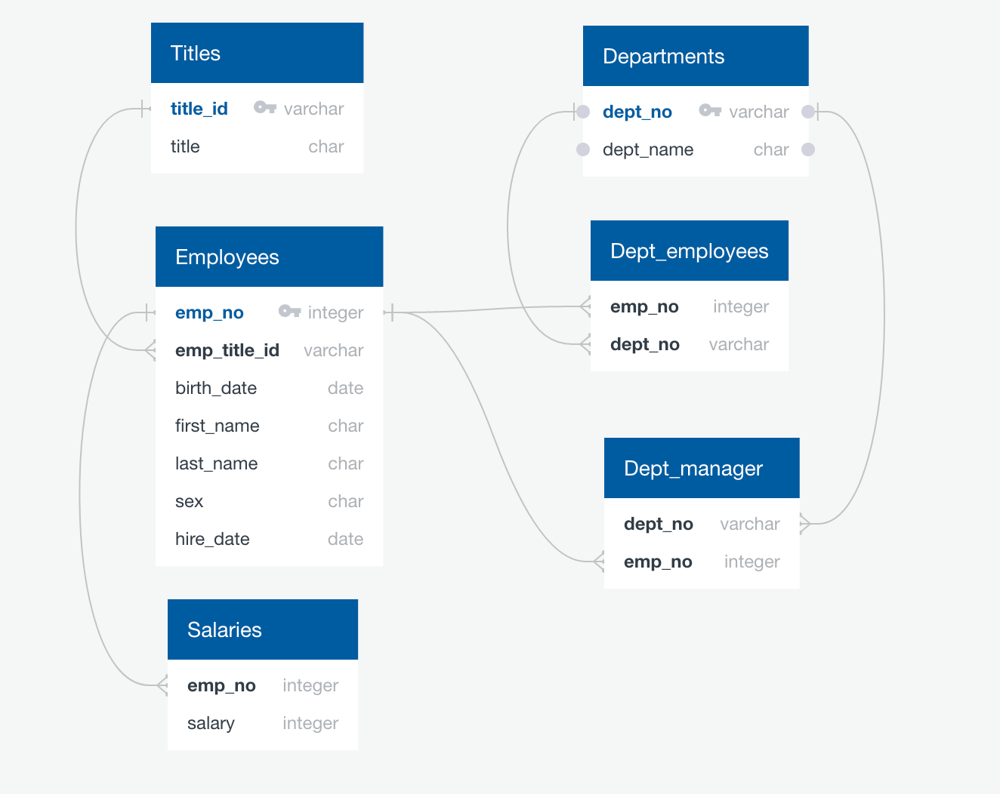

                                              
# Employee Database with SQL

## Background

The objective of this project is to conduct a research project on employees of a corporation from the 1980s and 1990s. All that remain of the database of employees from that period are six CSV files.

The next step is to design the tables to hold data in the CSVs, import the CSVs into a SQL database, and answer questions about the data. In other words, to perform the following:

1. Data Modeling

2. Data Engineering

3. Data Analysis

#### Data Modeling

To model the employee data a basic data modeling technique called Entity-Relationship Diagrams (ERD) was used. By using this technique six employee database entities or tables are identified. These entities are employees, departments, salaries, titles, department managers, and department employees. The attribute or the data type of the entities also presented. At last, the ER diagram was drawn to visualize the relationships between entities/objects (primary key or foreign keys in a database).

#### Data Engineering

Using the ERD, a table schema for each of the six CSV files is created including the datatypes, primary keys, foreign keys, and other constraints. The order of the table is based on the primary, and foreign arrangements.
Note to import each CSV file into the corresponding SQL table the order strictly should be followed to avoid errors.
Table creation script is: https://github.com/manishalal145/SQLChallenege/blob/main/table_schema.sql

#### Data Analysis

Once we have a complete database, we run the SQL queries to obtain the following:

1. List the following details of each employee: employee number, last name, first name, gender, and salary.

2. List employees who were hired in 1986.

3. List the manager of each department with the following information: department number, department name, the manager's employee number, last name, first name, and start and end employment dates.

4. List the department of each employee with the following information: employee number, last name, first name, and department name.

5. List all employees whose first name is "Hercules" and last names begin with "B."

6. List all employees in the Sales department, including their employee number, last name, first name, and department name.

7. List all employees in the Sales and Development departments, including their employee number, last name, first name, and department name.

8. In descending order, list the frequency count of employee last names, i.e., how many employees share each last name.

Queries are in this file: https://github.com/manishalal145/SQLChallenege/blob/main/queries.sql
